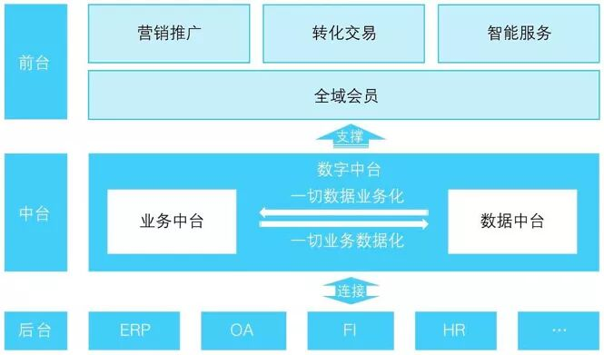

# 概念
```text
    随着业务的发展，每个产品都需要对应数量的开发者作为支撑，但在长期的协作中，开发团队都会遇到一些普遍难点：构建速度慢、开发测试周期长、协作困难等。
    在快速的业务迭代中，各团队的开发人员往往只会将所在团队的问题进行简单化的优化，因此团队重复造轮子、耦合严重的现象。每个团队都直接面对客户端就需
要每个成员既要懂业务，也要懂开发，既要懂UI、应用，还要懂数据库，甚至大数据。每个人都是全栈，代价高昂。
    针对这种情况，需要将开发中遇到的问题进行抽象、形成一个统一的解决方案。
    
    DDD+中台+微服务的形式，正好能解决当前问题。
```
